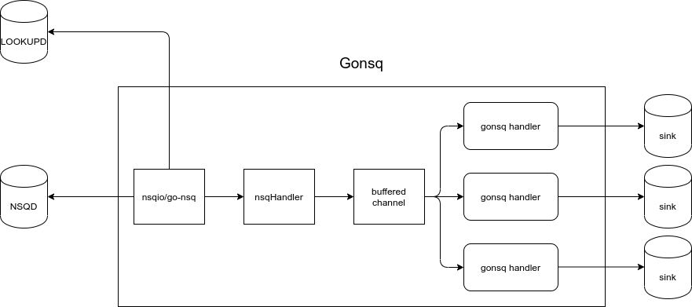

# Gonsq

**Work In Progress**

Gonsq is a wrapper of [go-nsq](https://github.com/nsqio/go-nsq) library.

This library is inspired by how [Lyft Building an Adaptive, Multi-Tenant Stream Bus with Kafka and Golang](https://eng.lyft.com/building-an-adaptive-multi-tenant-stream-bus-with-kafka-and-golang-5f1410bf2b40) and [Flow Control architecture in envoy proxy](https://github.com/envoyproxy/envoy/blob/master/source/docs/flow_control.md).

## Nsqio

Gonsq is not using standard `nsq.Consumer` and `nsq.Producer`, instead the library provides `NSQConsumer` and `NSQProducer` object to communicate directly with `nsq.Consumer` and `nsq.Producer`.

Some properties also added to the `NSQConsumer` object, for example `concurrency`. The `concurrency` information is used to inform the `Gonsq` about how many concurrent consumers that a given `NSQConsumer` want to run.

## Design

Gonsq implements its own flow control on top of `go-nsq` library by using `buffered channel. The messages that delivered to buffered channels, then consumed by internal `gonsq-handler` which run using goroutines. This mechanism gives gonsq a way to communicate with each concurrent handlers to be able to control the queue flow.

## Stats

The library is exposing some metrics for internal usage and might be useful for the user to send the metrics to some monitoring backend. The `stats` object is available through `nsq.Message` struct and passed to the message handler.

The exposed metrics are:

- Total Message Count: The total count of messages consumed by particular worker of `topic` and `channel`.
- Total Error Count: The total count of error happens in particular worker of `topic` and `channel`.
- Total Message In Buffer Count: The total count of buffer used in particular worker of `topic` and `channel`. This stat is used to determine whether a throttling mechanism need to be triggered or not.
- Total Buffer Length: The total length of buffer available for particular worker of `topic` and `channel`
- Total Concurrency: The total number of concurrency/woker for particular worker of `topic` and `channel`
- Total Worker Count: The current total number of worker for particular worker of `topic` and `channel`. This stat will be useful if we have a mechanism to reduce/increase the number of worker based on condition. For now, this is used to determine the number of worker on startup and shutdown.
- Throttled: The status of particular `topic` and `channel`, is the consumer is being `throttled` or not.

## How To Use The Library

To use this library, the `consumer` must be created using `nsq/nsqio`.

## TODO

- DNS: make it possible to specify a single addresss with host or single/multiple address with IP. If a single host is given, then resolve to host.